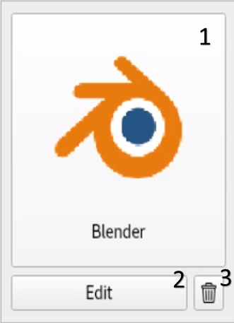

# App Launcher
GUI based system to configure and launch apps on Linux systems.
With this App Launcher, you can :

- Launch apps
- Search for apps
- Add new apps
- Configure the launch settings for the apps
- Remove apps

Documentation for the code can be found in [docs directory](docs/build/html/). Open [index.html](docs/build/html/index.html) in a browser.

## Table of Contents
- [Deployment Instruction](#deployment-instruction)
- [Database Structure](#database-structure)
- [User Guide](#user-guide)
- [Testing](#testing)

## Deployment Instruction
The following command uses PyInstaller to deploy the application.

```
pyinstaller --add-data="./ui/*:./ui/" --add-data="./icons/*:./icons/" --add-data="./AppDatabase.db:./" -n AppLauncher mainwindow.py
```

Run the executable application called "AppLauncher" in dist/AppLauncher/AppLauncher to use the deployed application.

## Database Structure
([AppDatabase.db](AppDatabase.db)) contains the following tables.

```
'App' (
    'Name' TEXT NOT NULL,
    'Path' TEXT NOT NULL,
    'Description' TEXT,
    'Icon' BLOB,
    'Command' TEXT,
    'Argument' TEXT,
    'AppID' INTEGER PRIMARY KEY AUTOINCREMENT
);

'Env' (
    'Name' TEXT NOT NULL,
    'Value' TEXT NOT NULL,
    'ExeOrder' INTEGER NOT NULL,
    'EnvID' INTEGER PRIMARY KEY AUTOINCREMENT,
    'AppID' INTEGER NOT NULL
);
```

An empty database can be generated by
```
sqlite3 AppDatabase.db < sql/initialEmptyDatabase.sql
```

## User Guide

The following demo shows the basic features of this application.

https://user-images.githubusercontent.com/72556403/169948713-3edc9b70-d23d-4e48-866c-c2595a70e644.mp4

### Main Window
Main Window displays a list of existing applications as widgets. User can add a new app, search for apps and launch, edit and remove an existing app from here. The window is responsive. The number of columns in the grid layout changes depending on the window width.


1. Add New Button - It opens an empty app dialog.
2. Search box - User can input any texts to search for apps.
3. Grid layout - A responsive, scrollable layout that displays the app widgets. 


1. Launch button - It launches the app when clicked. It displays the app description as a tooltip when moving the mouse over it.
2. Edit button - It opens an app dialog with the existing data.
3. Remove button - It pops up a message box to confirm the removal. It removes the app when click Yes button.

### App Dialog
App Dialog allows the user to input data for a new app or update the data for an existing app.


1. Name input box - To type in the name of the app. It displays a warning to fill in the form when try to save it without a name.
2. Path input box - To type in the path of the app. It displays a warning to fill in the form when try to save it without a name. The path can include environment variables in the form of "$ENV".
3. Lookup button - It displays a file dialog to allow the user to look for the app path.
4. Description input box - To type in the description of the app. This will be displayed as a tooltip when the user move the mouse over the launch button in the app widget. It is allowed to save the app without a description.
5. Icon button - To set an icon for the app. It displays a file dialog to choose an icon when clicked. It is allowed to save the app without an icon.
6. Remove icon button - A button to remove the icon.
7. Additional commands - Additional commands to be executed before launching the app. The commands are executed before adding the environment variables. Put "export ENV" in this section to add environment variables before executing other commands. Please do not add any empty lines in this section.
8. Environment variables table - Displays the environment variables added for the app. The environment variables will be added to the process before launching the app. These will be added in the order in this table. Please use up and down button to sort the order.
9. Up button - Move up the order of the selected environment variables. An environment variable must be selected before clicking this button. Otherwise it pops up a message box for a warning.
10. Down button - Move down the order of the selected environment variables. An environment variable must be selected before clicking this button. Otherwise it pops up a message box for a warning.
11. New button - A button to add a new environment variable. It displays an empty environment variable dialog.
12. Edit button - A button to edit an existing environment variable. It displays an environment variable dialog with the existing data. An environment variable must be selected before clicking this button. Otherwise it pops up a message box for a warning.
13. Remove button - A button to remove an existing environment variable. An environment variable must be selected before clicking this button. Otherwise it pops up a message box for a warning.
14. Argument - Arguments to pass when launching the app.
15. Save button - A button to save the app with the user inputs. It only allows to save the app when both name and path are set. Otherwise it pops up a message box for a warning.

### Environment Variable Dialog
Environment Variable Dialog allows the user to set an extra environment variable set to the process before launching the app.


1. Name input box - To type in the name of the environment variable. It displays a warning to fill in the form when try to save it without a name.
2. Path input box - To type in the value of the environment variable. It displays a warning to fill in the form when try to save it without a value.
3. Browse directory button - It displays a file dialog to choose a directory and set it as a environment value.
4. Browse File button - It displays a file dialog to choose a file and set it as a environment value.
5. Save button - A button to save the environment variable with the user inputs. It only allows to save the app when both name and value are set. Otherwise it pops up a message box for a warning.

#### Notes
- The environment variables used in path, additional commands and environment variables must be in the specific format ("$ENV") to be replaced with the value. Please use double quote instead of single quote.
- The additional commands are executed before adding the environment variables. Please add any environment variables used in the commands by adding a line in "export ENV" format.
- The environment variables are added in the order in the table in the app dialog. Please sort it using up/down button. It must be saved, otherwise the changes will be removed.

## Testing
This program has been tested using python unittest run by pytest.
TestCasess are in [tests directory](tests/). Tests can be run by the following command
```
pytest .
```
